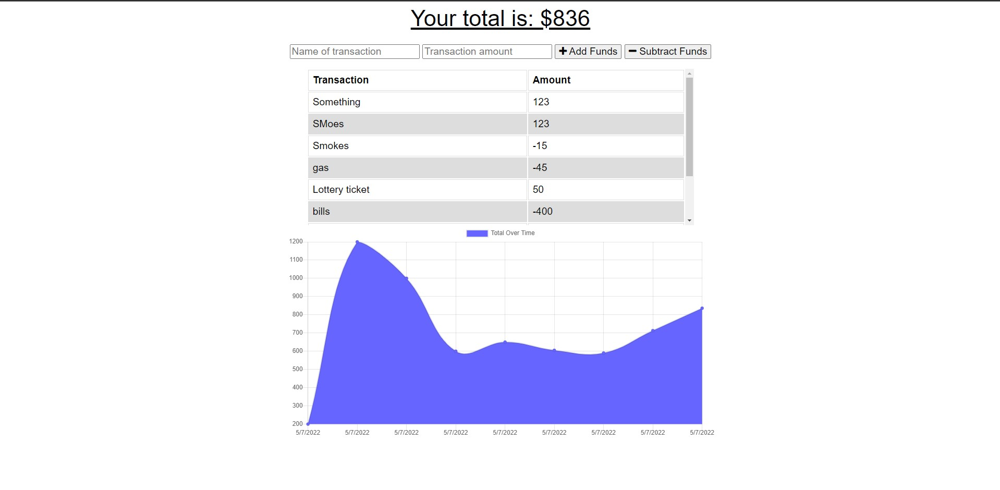

# budget-tracking

## Purpose

This application is used to track input funds and expenses, and can be used even while disconnected from an internet connect.

## Outline

- A user will input events/things that either add or subtract funds from their total.
- These inputs will be tracked along a graph that will dynamically change with each new input.
- While offline, inputs will still be tracked and added to the graph.

## Built With

- Javascript

## Screenshot

## Heroku Link

https://warm-scrubland-74253.herokuapp.com/
